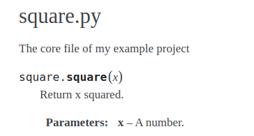

# Python Cookie Cutter

This is a template for python projects.


## Installation
```sh
pip install cookiecutter
```

Or with conda: 
```sh
conda install -c conda-forge cookiecutter
```

##  Usage
First, create a new github repo, do not check `Initialize this repository with a README`.

Then we will call cookiecutter in order to download the template:

Over SSH :
```sh
cookiecutter git@github.com:EdgarLefevre/python_cookiecutter.git
```

Over https:
```sh
cookiecutter https://github.com/EdgarLefevre/python_cookiecutter.git
```

Once everything is downloaded, run git commands:
```sh
git init
git remote add origin git@github.com:YOURNAME/YOURREPO.git
git add *
git commit -am "First commit"
git push -u origin master
```
## Architecture

The template provides a classic python project architecture:
 - data: python files relative to data (dataset preparation for example)
 - docs: folder where the documentation will be generated
 - models: here are all models (data science project)
 - src: here are your sources
 - test: folder for test files
 - utils: here you can put every file with misc function that you use in the project

With all those folders, come some config files:
 - .flake8, .pre-commit-config.yaml, pyproject.toml: are config files for pre-commit's hooks
 - .gitignore: config file for git, it excludes files from the git repo
 - README.md
 - install.sh: this is the final install script of the project, the one that users use. (The first section of the readme files will explain you how to install the project).

## Pre-commit

Along side with this template, a [pre-commit](pre-commit.com) pipeline is setup.
Once installed, this pipeline will run each time you do a commit, the main purpose of this pipeline is to check the code (style formating, imports, unused function...) and other things such as the conda environement file. The linters that we use here are mostly [flake8](https://flake8.pycqa.org/en/latest/) and [black](https://github.com/psf/black). 

The hooks are setup in `.pre-commit-config.yaml`, if you want to add (or remove) some, you have to edit this file.

Several usefull commands:
```sh
pre-commit install # install hooks
pre-commit clean # clean hooks (usefull when a hook is updated)
pre-commit run --all-files # run all hooks on all files
```

> Note: to avoid pre-commit running on a commit just do `git commit -am "msg" --no-verify` but this not really recommended.

> If you don't understand a flake8 error look at https://www.flake8rules.com/rules/E722.html (with your error id)


## Pytest

For the tests we choose to use [pytest](https://docs.pytest.org/en/stable/). This is a classic python test library, very easy to use.

To run the tests, you just have to run pytest:
```shell script
pytest
```

Pytest is integrated as a hook, with this setup, we ensure that tests pass at every commit.

## Coverage.py

[Coverage.py](coverage.readthedocs.io/) is a classic python library for running coverage test.

With this lib, we can run the tests and see if there is useless code and we forgot to test some functions.

To do that, you just need to run:
```shell script
coverage run -m pytest
```
This line will create a `.coverage` file (binary file), to see the file you have to run:
```shell script
coverage report -m 
```

This is also implemented as a hook, if there less of 75% of the code covered this will produce an error.

## Sphinx

[Sphinx](https://www.sphinx-doc.org/en/master/index.html) is used to generate documentation for the project. 

By setting up few things and comment functions in the code, Sphinx will be able to generate html documentation.

[Tuto](https://medium.com/@eikonomega/getting-started-with-sphinx-autodoc-part-1-2cebbbca5365)

### Using Sphinx
Installation: 
```shell script
conda install -c conda-forge sphinx
```

Initialization (at project's root):
```shell script
mkdir docs
cd docs
sphinx quick-start
```

The last command will generate few files and folders inside the docs folder, we need to modify some of these files.

In `conf.py` change:
```python
# import os
# import sys
# sys.path.insert(0, os.path.abspath('.'))
```

To:
```python
import os
import sys
sys.path.insert(0, os.path.abspath('..'))
```

And then add extensions to extensions' list:
```python
# from:
extensions = []
# to:
extensions = ['sphinx.ext.autodoc', 'sphinx.ext.coverage', 'sphinx.ext.napoleon']
```

Then in `index.rst`:

From: 
```rst
.. Getting Started with Sphinx documentation master file, created by
   sphinx-quickstart on Mon Nov 13 11:41:03 2017.
   You can adapt this file completely to your liking, but it should at least
   contain the root `toctree` directive.
Welcome to Getting Started with Sphinx's documentation!
=======================================================
.. toctree::
   :maxdepth: 2
   :caption: Contents:
Indices and tables
==================
* :ref:`genindex`
* :ref:`modindex`
* :ref:`search`
```

To:

```rst
Welcome to Getting Started with Sphinx's documentation!
=======================================================
.. automodule:: square
    :members:
.. toctree::
   :maxdepth: 2
   :caption: Contents:
Indices and tables
==================
* :ref:`genindex`
* :ref:`modindex`
* :ref:`search`
```

Last but not least, we need to add comments to our functions:
```python
"""
square.py
============================

The core file of my example project
"""


def square(x):
    """
    Return x squared.

    Parameters
    ------------------
    x
        A number.
    """
    return x * x
```
Once, when we have commented all our functions:
```shell script
cd docs
make html
```
This will generate html files in `docs/_build/html/`, the one we are interested in is `index.html`.


Example of what the previous sample will look like.


